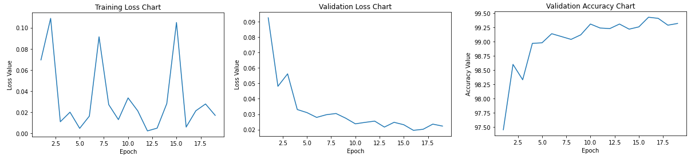
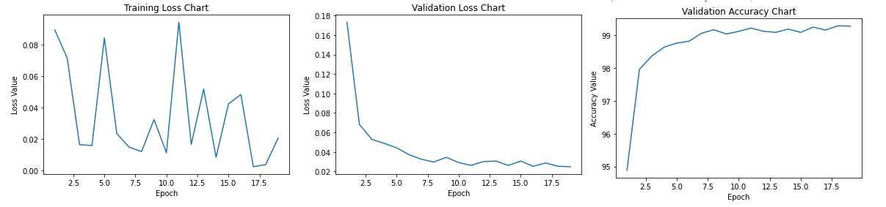
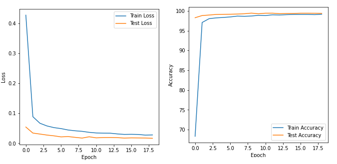
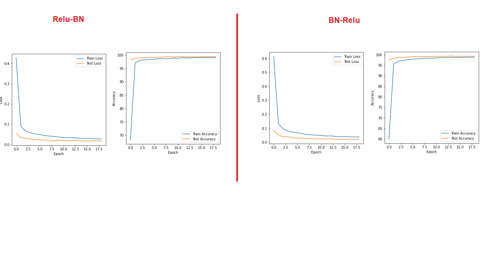

Training a Neural Network with MNIST Data
===============================================

Training a Model with MNIST data is very simple. It’s basically a classification model to look into the image and predict the handwritten digit accurately. All of us can do it. But to make it a little fun we have added some constraints to it. Let’s understand the model input, output and architecture first before getting into the code. SO here is how the readme has been structured

1.	Input 
2.	Constraints
3.	Network 
4.	Parameters
5.	Output
6.	How we arrived at it
7.	Takeaway

Input
======
MNIST data which is nothing but the images of handwritten digits 

Constraints
===========
1.	The Parameters must be with in 12k – 18k
2.	We must run the model for exactly 19 epochs
3.	Must use Batch Normalization, FC Layer and GAP
4.	Dropout value must be 0.069 only
5.	We must consider using 1 x1 kernel to show the power of going deep without putting extra burden on GPU. Basically consolidating 

Network 
==============
The Network consists of around 6 Convolution layers, 2 Maxpool Layers, GAP Layer, FC layer as well.

Here is the structure if the network in details 

Typical Structure 
==================
1. Convolution Layer of 3 x 3 Kernel with Padding of 1 
2. ReLu
3. Batch Normalization - Regularization Technique 
4. Dropout              - Regularization Technique 
5. Maxpool after 3 Layers 

-	Example 
self.conv1 = nn.Sequential(
            nn.Conv2d(1, 8, 3, padding=1, bias=False),
            nn.ReLU(),
            nn.BatchNorm2d(8),
            nn.Dropout2d(p=dropout_prob)
        )

Additional Structures
======================
1. Convolution Layer of 1 x 1 Kernel to consolidate without convolution 
2. Global Average Pooling 
3. Linear Layer 

Special Considerations
========================
1. The Maxpool layers are placed such a way that the receptive field is 7 x 7 or 9 x9 (Ideally for imagenet type of images 11 x 11 is better). But MNIST is an easy dataset so 7 x 7 should be good enough

2. No ReLu, BN or Dropout towards the end of the netowrk (Target prediction zone)

3. As less parameter as possible (near to the lower limit of 12000)
4. Dropout of 0.069 - As asked
5. Rotation of -5% to 5 %
6. Normalization
7. Batch size of 128 

Parameters
============

The model has been built to train with minimum number of parameters without putting extra burden on GPU. The toal number of parameters we have taken is roughly 12k

For hyperparameters I would encourage to take a look at the model code as it’s self-explanatory 

Output
======

‘<=99.4%” Accuracy in less than 20 epochs 

What you think? It’s easy or difficult?

Let me tell you if you understand the concept then it’s all about spending some time with multiple iterations.

How we arrived at it
=====================

If you see the code and the outcome it’s pretty evident that the model validated with over 99.4 % accuracy multiple times. But here I want to put few special mentions to ensure that we not only now what we get but also major experiments we did. But for readability, I will write only important ones and the outcomes only
Used Even size kernel and avg2d 
In this network we used only Maxpooling layer with an intention to keep Maxpool as far as possible to the last layer. We also used avg2d instead of adaptive one.
The model trained and validation accuracy reached 99.4 % multiple times but the training curve was not smooth.

- Did we Try networks without Batch Normalization, Dropout and higher value of dropout? Yes, we did. The accuracy was also > 99.4 %. But again, the curve was not smooth 

Again, surprisingly when I updated the same model with 1 x1 kernel and adaptive pooling with GAP at 5x5 image size the model could not achieve 99.4 % accuracy. Stuck at 99.37 % - 99.38 %. Initially I thought it might be for random initialization but after running it multiple times I found that’s not the case

Now this network which is the final one gave accuracy multiple times between 1-20 epoch. The curve is also smooth.

Log
======
0%|          | 0/469 [00:00<?, ?it/s]Currently Executing Epoch: 1
/usr/local/lib/python3.7/dist-packages/ipykernel_launcher.py:67: UserWarning: Implicit dimension choice for log_softmax has been deprecated. Change the call to include dim=X as an argument.
Loss=0.06623551994562149 Batch_id=468 Accuracy=86.28: 100%|██████████| 469/469 [00:20<00:00, 23.26it/s]
/usr/local/lib/python3.7/dist-packages/torch/optim/lr_scheduler.py:134: UserWarning: Detected call of `lr_scheduler.step()` before `optimizer.step()`. In PyTorch 1.1.0 and later, you should call them in the opposite order: `optimizer.step()` before `lr_scheduler.step()`.  Failure to do this will result in PyTorch skipping the first value of the learning rate schedule. See more details at https://pytorch.org/docs/stable/optim.html#how-to-adjust-learning-rate
  "https://pytorch.org/docs/stable/optim.html#how-to-adjust-learning-rate", UserWarning)
  0%|          | 0/469 [00:00<?, ?it/s]
Test set: Average loss: 0.0542, Accuracy: 9828/10000 (98.28%)

Currently Executing Epoch: 2
Loss=0.07634750753641129 Batch_id=468 Accuracy=97.29: 100%|██████████| 469/469 [00:20<00:00, 23.16it/s]
  0%|          | 0/469 [00:00<?, ?it/s]
Test set: Average loss: 0.0340, Accuracy: 9883/10000 (98.83%)

Currently Executing Epoch: 3
Loss=0.03574162349104881 Batch_id=468 Accuracy=98.00: 100%|██████████| 469/469 [00:20<00:00, 22.96it/s]
  0%|          | 0/469 [00:00<?, ?it/s]
Test set: Average loss: 0.0308, Accuracy: 9896/10000 (98.96%)

Currently Executing Epoch: 4
Loss=0.021819936111569405 Batch_id=468 Accuracy=98.28: 100%|██████████| 469/469 [00:20<00:00, 23.15it/s]
  0%|          | 0/469 [00:00<?, ?it/s]
Test set: Average loss: 0.0274, Accuracy: 9911/10000 (99.11%)

Currently Executing Epoch: 5
Loss=0.04234654828906059 Batch_id=468 Accuracy=98.36: 100%|██████████| 469/469 [00:20<00:00, 23.09it/s]
  0%|          | 0/469 [00:00<?, ?it/s]
Test set: Average loss: 0.0248, Accuracy: 9914/10000 (99.14%)

Currently Executing Epoch: 6
Loss=0.052025169134140015 Batch_id=468 Accuracy=98.48: 100%|██████████| 469/469 [00:20<00:00, 22.97it/s]
  0%|          | 0/469 [00:00<?, ?it/s]
Test set: Average loss: 0.0213, Accuracy: 9916/10000 (99.16%)

Currently Executing Epoch: 7
Loss=0.009478755295276642 Batch_id=468 Accuracy=98.63: 100%|██████████| 469/469 [00:20<00:00, 23.06it/s]
  0%|          | 0/469 [00:00<?, ?it/s]
Test set: Average loss: 0.0224, Accuracy: 9921/10000 (99.21%)

Currently Executing Epoch: 8
Loss=0.05772705376148224 Batch_id=468 Accuracy=98.69: 100%|██████████| 469/469 [00:20<00:00, 22.99it/s]
  0%|          | 0/469 [00:00<?, ?it/s]
Test set: Average loss: 0.0198, Accuracy: 9929/10000 (99.29%)

Currently Executing Epoch: 9
Loss=0.01770886965095997 Batch_id=468 Accuracy=98.73: 100%|██████████| 469/469 [00:20<00:00, 23.10it/s]
  0%|          | 0/469 [00:00<?, ?it/s]
Test set: Average loss: 0.0173, Accuracy: 9944/10000 (99.44%)

Currently Executing Epoch: 10
Loss=0.058960724622011185 Batch_id=468 Accuracy=98.85: 100%|██████████| 469/469 [00:20<00:00, 22.97it/s]
  0%|          | 0/469 [00:00<?, ?it/s]
Test set: Average loss: 0.0216, Accuracy: 9929/10000 (99.29%)

Currently Executing Epoch: 11
Loss=0.06814174354076385 Batch_id=468 Accuracy=98.93: 100%|██████████| 469/469 [00:20<00:00, 22.94it/s]
  0%|          | 0/469 [00:00<?, ?it/s]
Test set: Average loss: 0.0181, Accuracy: 9942/10000 (99.42%)

Currently Executing Epoch: 12
Loss=0.08384868502616882 Batch_id=468 Accuracy=98.95: 100%|██████████| 469/469 [00:20<00:00, 23.17it/s]
  0%|          | 0/469 [00:00<?, ?it/s]
Test set: Average loss: 0.0191, Accuracy: 9943/10000 (99.43%)

Currently Executing Epoch: 13
Loss=0.035104893147945404 Batch_id=468 Accuracy=98.94: 100%|██████████| 469/469 [00:20<00:00, 22.93it/s]
  0%|          | 0/469 [00:00<?, ?it/s]
Test set: Average loss: 0.0193, Accuracy: 9931/10000 (99.31%)

Currently Executing Epoch: 14
Loss=0.006110087502747774 Batch_id=468 Accuracy=99.00: 100%|██████████| 469/469 [00:20<00:00, 23.06it/s]
  0%|          | 0/469 [00:00<?, ?it/s]
Test set: Average loss: 0.0189, Accuracy: 9935/10000 (99.35%)

Currently Executing Epoch: 15
Loss=0.005162848625332117 Batch_id=468 Accuracy=99.07: 100%|██████████| 469/469 [00:20<00:00, 22.92it/s]
  0%|          | 0/469 [00:00<?, ?it/s]
Test set: Average loss: 0.0173, Accuracy: 9936/10000 (99.36%)

Currently Executing Epoch: 16
Loss=0.007750762160867453 Batch_id=468 Accuracy=99.06: 100%|██████████| 469/469 [00:20<00:00, 22.97it/s]
  0%|          | 0/469 [00:00<?, ?it/s]
Test set: Average loss: 0.0181, Accuracy: 9942/10000 (99.42%)

Currently Executing Epoch: 17
Loss=0.060273587703704834 Batch_id=468 Accuracy=99.07: 100%|██████████| 469/469 [00:20<00:00, 23.18it/s]
  0%|          | 0/469 [00:00<?, ?it/s]
Test set: Average loss: 0.0178, Accuracy: 9942/10000 (99.42%)

Currently Executing Epoch: 18
Loss=0.019279396161437035 Batch_id=468 Accuracy=99.11: 100%|██████████| 469/469 [00:20<00:00, 22.97it/s]
  0%|          | 0/469 [00:00<?, ?it/s]
Test set: Average loss: 0.0175, Accuracy: 9941/10000 (99.41%)

Currently Executing Epoch: 19
Loss=0.011843018233776093 Batch_id=468 Accuracy=99.11: 100%|██████████| 469/469 [00:20<00:00, 22.93it/s]

Test set: Average loss: 0.0166, Accuracy: 9939/10000 (99.39%)

Takeaway
==============
We also modified the network to apply Batch Normalization before Relu. The network was smooth and achieved 99.4 % but not as many times as before. We understand the BN-Relu sequence doesn’t matter and performance should be same. We will investigate little more into it and find out why the performance degraded slightly in later. Is it because of the MNIST dataset? or something else.

A side-by-side comparison to keep in mind 
==========================================
 

